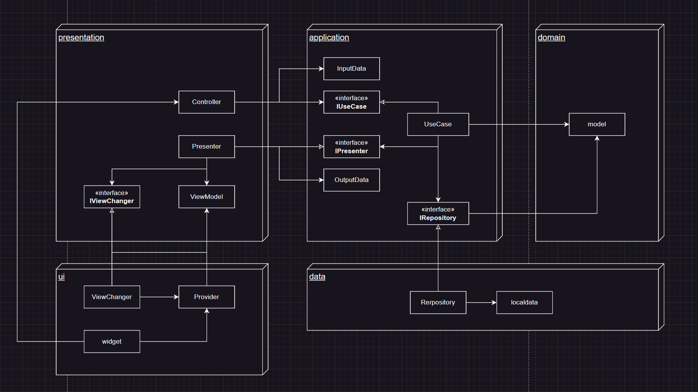

    <h2>路線図クイズアプリ</h2>
    

## 使用技術
Flutter/Dart

## 内部設計
アーキテクチャはクリーンアーキテクチャを採用しています
### レイヤー構造

- domain層 
ビジネスルールを定義する

- application層 
domain層で定義したビジネスルールを制御する

- presentation層 
ui層からの入力の受け取りと、ui層への出力の受け渡しを行う

- ui層 
画面描画に関する処理を定義する 
Flutterやriverpod等、画面描画に関するフレームワークやライブラリに依存するのはui層だけ

- data層 
データの取得、更新処理を行う

### クラス図
クリーンアーキテクチャ書籍のクラス構成をほとんどそのまま採用しています

### 今後やりたいこと
- 対応路線の追加
- 単体テスト、Widgetテスト、統合テストの実装
- クラス構成の見直し 
現在のクラス構成だと、1つの機能に対してのクラス数がかなり多いので、実装に時間がかかる 
クリーンアーキテクチャの考え方に反しない程度にクラスを統合できないか考えたい

## AppStore Url
**https://apps.apple.com/jp/app/%E8%B7%AF%E7%B7%9A%E5%9B%B3%E3%82%AF%E3%82%A4%E3%82%BA/id6469034225?platform=iphone**

